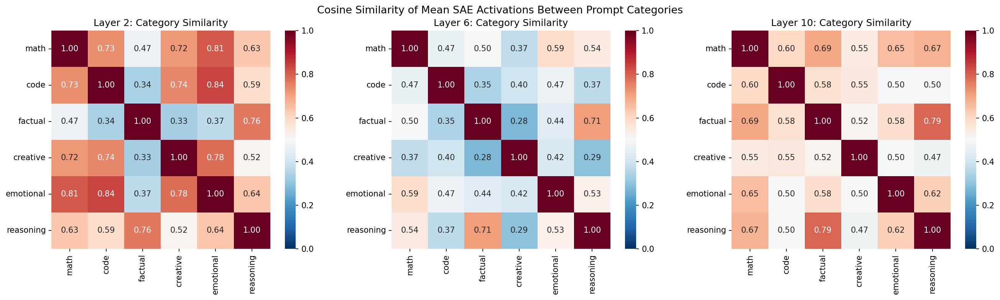
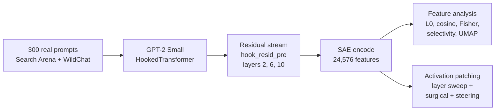
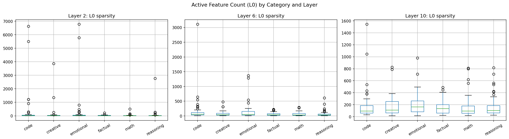
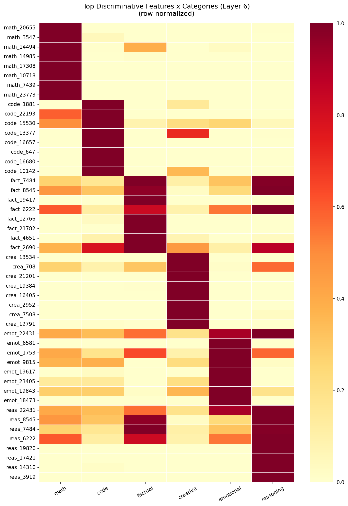
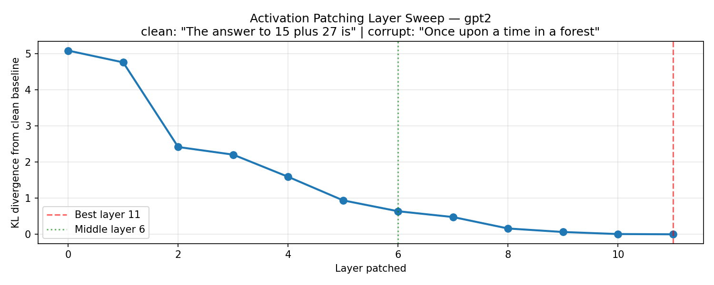

# Prompt Categories in the SAE Feature Basis of GPT-2

**Where inside a language model does "this is a math question" get decided, and does that decision actually drive what the model says next?**

We ran 300 real human prompts across six categories through GPT-2 Small, decomposed the residual stream into 24,576 sparse autoencoder features at three depths, and then cut the model open with activation patching to test whether the features we found are causal or merely correlated.

The short answer: category is encoded early and sparsely, but the computation that acts on it is spread across hundreds of features. Patching the ten most math-selective feature directions recovers only 4.5% of the causal effect you get from patching the whole residual stream at the same layer. That is superposition, measured at the level of task category rather than individual tokens.

<p align="center">
  
</p>

---

## Headline results

| Question | Finding | Evidence |
|---|---|---|
| Do prompt categories produce distinct feature signatures? | Yes. Every category has features that fire for it and almost nothing else. | Top selectivity scores of 0.99 (math) to 2.11 (reasoning); see the feature heatmap below |
| How many features does a prompt use? | Between 26 and 344 out of 24,576 at layer 2, a 13x spread across categories. | Factual 26.3, math 34.1, reasoning 81.1, creative 129.9, emotional 321.2, code 344.2 |
| Does that spread survive depth? | No. By layer 10 every category sits between 157 and 205 active features. | 1.3x spread at layer 10 versus 13x at layer 2 |
| Where does causal influence live? | It accumulates monotonically with depth. | KL divergence from the clean run falls from 5.08 at layer 0 to 0.00 at layer 11, with no reversals |
| Is category information localized? | No. Ten features are nowhere near enough. | Full residual patch at layer 6 cuts KL from 3.61 to 0.64. Patching only the top 10 math directions gets to 3.48, which is 4.5% of the available effect |

Two features turned out to be shared rather than category exclusive. Feature `#22431` is the top feature for both reasoning (2.11) and emotional (1.70), which suggests it tracks something closer to "this query needs deliberation" than to either label. Features `#7484`, `#8545` and `#6222` appear in the top five for both factual and reasoning, which fits the idea that reasoning prompts carry factual content along with them.

---

## Why sparse autoencoders

GPT-2 Small has 768 residual dimensions and needs to represent far more than 768 concepts, so it stores them as overlapping directions. Individual neurons end up polysemantic: neuron 500 might respond to Python syntax, the word "function", and formal register all at once. Reading meaning off single neurons does not work.

A sparse autoencoder learns an overcomplete dictionary over those activations:

```
z = ReLU(W_enc · x + b_enc)      x is 768-dim, z is 24,576-dim and mostly zero
x̂ = W_dec · z + b_dec            trained on ‖x − x̂‖² + λ‖z‖₁
```

The 32x expansion plus the L1 penalty pushes each dictionary element toward a single concept. We did not train any of this. The `gpt2-small-res-jb` release from Joseph Bloom provides one SAE per layer, loaded through `sae_lens`.

---

## Pipeline



For every prompt we take the residual vector at the **last token position**. Under causal attention that position has attended to the whole prompt, so it carries the most context of any single position. 300 prompts across 3 layers gives 900 feature vectors of 24,576 dimensions each. Extraction takes about 37 seconds on an RTX 3050 Ti.

### The data

An earlier version of this project used 120 prompts we wrote ourselves. Our instructor pointed out that hand written prompts encode the researcher's idea of what a math question looks like rather than what people actually type, so we replaced all of them with real user queries:

| Source | Scale | Label used | Categories drawn |
|---|---|---|---|
| [Search Arena 24k](https://huggingface.co/datasets/lmarena-ai/search-arena-24k) | 24,069 conversations | `primary_intent`, annotated with Cohen's κ = 0.812 | factual, reasoning, creative |
| [WildChat 4.8M](https://huggingface.co/datasets/allenai/WildChat-4.8M) | 2.75M messages | `topic` | code, math, emotional |

WildChat is 27 GB, so notebook 00 streams it through the HuggingFace API instead of downloading it. Every candidate prompt passes five filters before it can be sampled: 3 to 200 words, alphabetic character ratio above 0.5 to reject URL and symbol soup, type token ratio above 0.3 to reject repetition spam, at most 512 GPT-2 tokens so nothing gets truncated mid extraction, and exact match deduplication across both sources. Final sampling is `random.sample` under seed 42, 50 prompts per category.

The categories keep their real world messiness. Median length runs from 8 words for factual to 40 for emotional, and the corpus is multilingual because the source corpora are.

---

## What the results look like

### Sparsity carries category information on its own

<p align="center">
  
</p>

Code and emotional prompts recruit an order of magnitude more features than factual and math prompts at layer 2. That reading is intuitive: answering "who won the 1998 World Cup" needs one retrieval, while answering "why does my React component re-render twice" needs syntax, library semantics, control flow and intent all at once. By layer 10 the difference is gone, which is what you would expect if the late layers have stopped representing the prompt and started shaping a next token distribution.

### Selective features exist, and some of them are shared

<p align="center">
  
</p>

Each block of rows holds the top features for one category, and the columns are the six category means. Most blocks are dark on their own column and pale everywhere else, which is the clean selectivity case. The interesting exceptions are the reasoning and emotional blocks, which bleed into factual and into each other.

### Category separability is real but weak in the raw feature space

Fisher's discriminant ratio over all 24,576 dimensions comes out at **0.0287** (layer 2), **0.0235** (layer 6) and **0.0259** (layer 10). Layer 2 wins, which matches the sparsity result: the model sorts the input early. The absolute values are small, and the UMAP projection at layer 6 agrees. It splits the 300 prompts into two clusters that cut straight across all six categories rather than separating them, so whatever dominates the local neighborhood structure at layer 6 is not category.

We are reporting this rather than burying it. Category is recoverable from these activations, but it is not the largest source of variance in them, and a projection tuned for local structure will find something else first.

### Causal influence accumulates with depth

<p align="center">
  
</p>

Clean prompt: `"The answer to 15 plus 27 is"`. Corrupt prompt: `"Once upon a time in a forest"`. We overwrite the corrupt run's residual stream at one layer with the clean run's and measure how far the output distribution moves toward clean.

| Layer patched | 0 | 2 | 4 | 6 | 8 | 10 | 11 |
|---|---|---|---|---|---|---|---|
| KL from clean | 5.08 | 2.42 | 1.59 | 0.64 | 0.16 | 0.007 | 0.000 |

No reversals anywhere in the 12 layer sweep. Note the tension with the separability result: layer 2 separates categories best and moves the output least, layer 11 does the opposite.

### Ten features are not enough

At layer 6, with a no patch baseline of KL 3.61:

| Intervention | Dimensions touched | KL | Share of full effect |
|---|---|---|---|
| No patch | 0 | 3.61 | 0% |
| Full residual patch | 768 | 0.64 | 100% |
| Surgical patch, top 10 math directions | 10 | 3.48 | **4.5%** |

The surgical patch projects the corrupt residual off each of the top ten math feature directions and substitutes the clean run's component along them. It produces a real, repeatable effect, and it is small. Math relevant computation at layer 6 lives in hundreds of features, not ten.

Feature steering agrees. Adding 20x the mean of the top ten math decoder directions to a neutral prompt changes the generation measurably without making it recognizably mathematical.

---

## Repository layout

```
.
├── 00_data_preparation.ipynb      Source, map, filter and sample 300 prompts; EDA
├── 01_setup_and_model.ipynb       Load GPT-2 Small and the SAE; write results/config.json
├── 02_feature_extraction.ipynb    900 feature vectors from 300 prompts x 3 layers
├── 03_prompt_analysis.ipynb       L0, cosine similarity, Fisher, selectivity, UMAP
├── 04_activation_patching.ipynb   Layer sweep, surgical patching, feature steering
├── 05_final_report.ipynb          Everything assembled with figures and discussion
├── data/                          Prompt sets and provenance metadata
├── results/                       config.json, discriminative features, all figures
└── docs/                          Written report, concept explainer, results walkthrough
```

Notebooks resolve every path relative to the repository root, so run Jupyter from the root of this checkout. `results/config.json` is written by notebook 01 and read by 02 through 05, which keeps model and SAE selection in one place.

---

## Running it

```bash
git clone https://github.com/ankitmukhopadhyay/Sparse-Auto-Encoder.git
cd Sparse-Auto-Encoder
python -m venv .venv && source .venv/bin/activate    # .venv\Scripts\activate on Windows
pip install -r requirements.txt
jupyter lab
```

Run the notebooks in numeric order. Notebook 02 writes about 85 MB of `.npz` activation arrays to `results/feature_activations/`, which is gitignored, so 03 through 05 need 02 to have run first. A CUDA GPU with 4 GB is enough. Everything runs on CPU too, slower.

Two environment notes that cost us time and might cost you some:

- `transformers >= 4.49` dropped `BertForPreTraining` and `T5ForConditionalGeneration` from the top level namespace, which breaks `transformer_lens` on import. Notebook 01 patches the names back in before importing.
- bfloat16 triggers CUBLAS failures during patching on consumer cards. Notebook 04 runs in float32 for that reason. Extraction stays in bfloat16.

---

## Documents

| File | What it is |
|---|---|
| [`docs/Final_Report.pdf`](docs/Final_Report.pdf) | The full written report with methodology, results and reflection |
| [`docs/PROJECT_EXPLAINER.md`](docs/PROJECT_EXPLAINER.md) | Every concept in the project explained twice, once for an ML researcher and once for someone with no background |
| [`docs/Results_Walkthrough.pdf`](docs/Results_Walkthrough.pdf) | Slide by slide walkthrough of the findings |
| [`docs/LLM_Internals_Primer.pdf`](docs/LLM_Internals_Primer.pdf) | Standalone primer on residual streams, superposition and SAEs |

---

## Limitations

GPT-2 Small is 124M parameters. Concept storage in larger models may be more localized, and the distributed result here may not transfer. We read one token position per prompt, so any category signal that lives in the middle of a prompt is invisible to us. The SAE is a fixed dictionary, so features `gpt2-small-res-jb` never learned cannot show up in our analysis no matter how real they are. Fifty prompts per category is thin for separating categories that are genuinely close, like reasoning and factual. Search Arena's κ = 0.812 applies to its own nine intent scheme, not to our six category remapping of it. Our regex split of `tutoring_or_teaching` into math and reasoning produces both false positives and false negatives.

## Next steps

Pull max activating examples for the top 20 features per category from Neuronpedia and turn opaque indices into named concepts. Ablate features rather than patch them, so we can separate features that are necessary from features that merely correlate. Rerun the whole pipeline on Gemma 2 2B with Gemma Scope to test whether "categories separate best early" is a property of transformers or an artifact of GPT-2 Small. Then run AdvBench and HarmBench prompts against benign equivalents to see whether jailbreaks leave an early layer SAE signature usable as a cheap runtime filter.

---

## Built with

`transformer_lens` for hooked forward passes, `sae_lens` for the pre-trained SAEs, PyTorch, NumPy, scikit-learn, `umap-learn`, matplotlib and seaborn. Seed 42 everywhere.

## References

- Elhage et al. (2022). [Toy Models of Superposition](https://transformer-circuits.pub/2022/toy_model/index.html). *Transformer Circuits Thread*.
- Bricken et al. (2023). [Towards Monosemanticity](https://transformer-circuits.pub/2023/monosemantic-features/index.html). *Transformer Circuits Thread*.
- Cunningham et al. (2023). [Sparse Autoencoders Find Highly Interpretable Features in Language Models](https://arxiv.org/abs/2309.08600). ICLR 2024.
- Templeton et al. (2024). [Scaling Monosemanticity](https://transformer-circuits.pub/2024/scaling-monosemanticity/). *Transformer Circuits Thread*.
- Meng et al. (2022). [Locating and Editing Factual Associations in GPT](https://arxiv.org/abs/2202.05262). NeurIPS 2022.
- Lieberum et al. (2024). [Gemma Scope](https://arxiv.org/abs/2408.05147). arXiv:2408.05147.
- Bloom, J. (2024). [SAELens](https://github.com/jbloomAus/SAELens), SAE release `gpt2-small-res-jb`.
- Nanda, N. (2022). [TransformerLens](https://github.com/TransformerLensOrg/TransformerLens).

---

## Authors

Myat Pyae Paing, Ankit Mukhopadhyay and Tianqi Min.
CS 463/663, Foundations of Machine Learning, University of San Francisco.

Thanks to our instructor for pushing us off synthetic prompts and onto real user data, and to Joseph Bloom for releasing `gpt2-small-res-jb`, without which none of this would have fit on a laptop GPU.

Released under the [MIT License](LICENSE).
